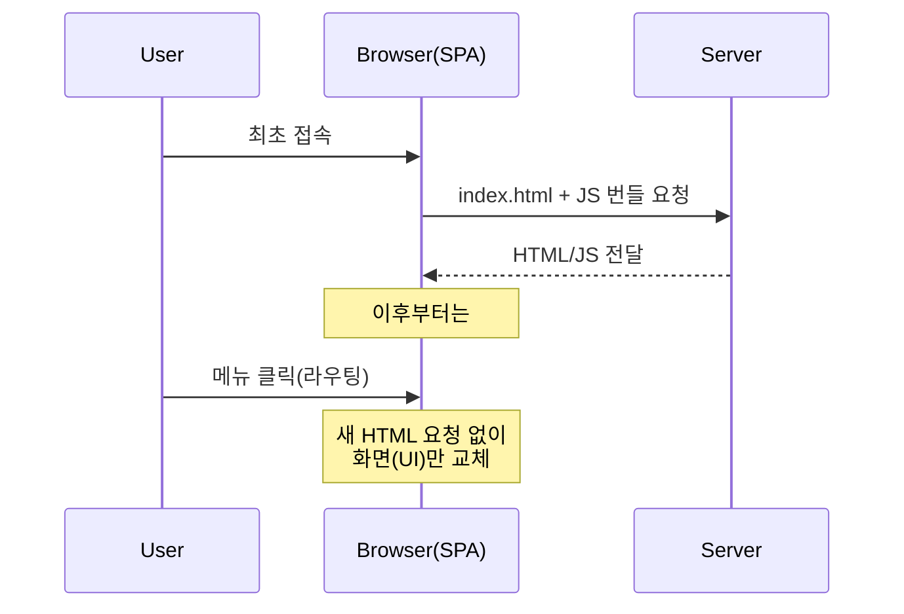
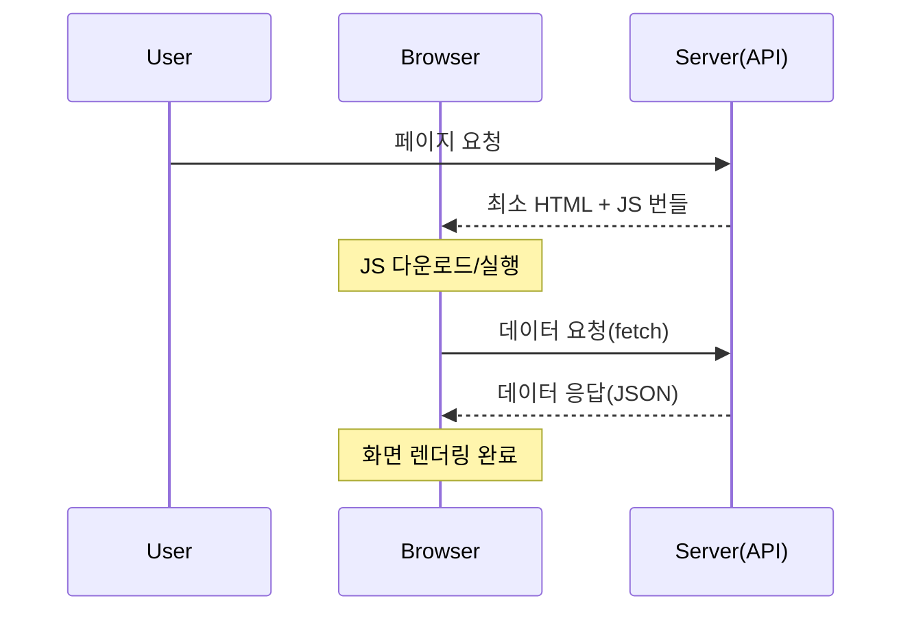
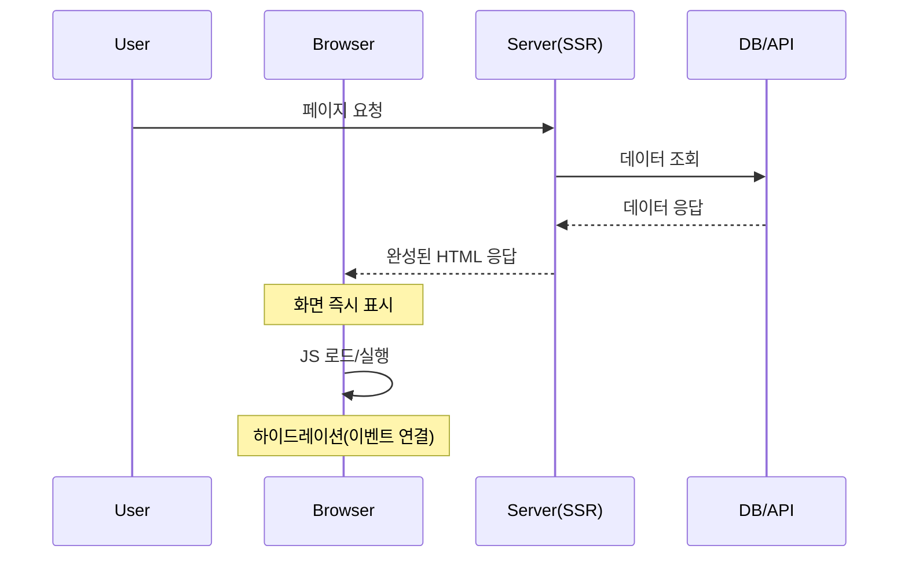

SPA, CSR, SSR은 **React에서 나온 개념이 아니다.**  
이 용어들은 웹 앱을 만드는 **방식(아키텍처/렌더링 전략)**을 설명하는 개념이고, React는 그 방식을 구현할 때 자주 쓰이는 **도구**일 뿐이다.

React를 공부하다 보면 이 단어들을 한 세트처럼 만나서 “React 개념인가?” 싶지만, 정확히는 다음처럼 이해하면 깔끔하다.

- **SPA**: 페이지 구조/동작 방식
- **CSR / SSR**: 화면(HTML)을 “어디서” 만들고 그리느냐(렌더링 위치)

---
 

## 1) SPA (Single Page Application)

### 개념

SPA는 말 그대로 페이지가 한 장(Single Page)처럼 동작하는 웹 앱이다.

- 처음에 `index.html` 같은 한 개의 HTML을 받아오고
- 그 이후 화면 전환은 새 HTML을 받는 게 아니라
- JS가 화면을 갈아 끼우는 방식으로 동작한다.

### 특징

- URL이 바뀌어도(라우팅) 실제로는 페이지 전체 새로고침 없이 화면만 바뀌는 느낌
- React Router 같은 클라이언트 라우터를 많이 사용
- 앱처럼 “즉각적인” 화면 전환 경험을 주기 쉬움

---
 

## 2) CSR (Client-Side Rendering)

### 개념
CSR은 화면을 그리는(렌더링하는) 주체가 **브라우저(클라이언트)**인 방식이다.

- 서버는 빈 껍데기 HTML + JS 번들을 내려주고
- 브라우저가 JS를 실행해서
- DOM을 만들고 화면을 구성한다.

### 장점
- 한 번 로딩 이후 인터랙션이 부드러움
- 화면 전환이 빠르게 느껴질 수 있음(라우팅/상태 전환)

### 단점
- 첫 화면이 뜨기까지 시간이 길어질 수 있음 (JS 다운로드/실행 필요)
- SEO(검색 엔진)에서 불리할 수 있음(상황에 따라 다름)

> 핵심: CSR은 “렌더링을 브라우저가 담당하는 방식”이다.

---
 

## 3) SSR (Server-Side Rendering)

### 개념
SSR은 화면을 그리는(렌더링하는) 주체가 **서버**인 방식이다.

- 사용자가 페이지를 요청하면
- 서버가 **완성된 HTML**을 만들어서 내려준다.
- 브라우저는 HTML을 받자마자 화면을 빠르게 보여줄 수 있다.

### 장점

- 첫 화면 표시가 빠를 수 있음
- SEO에 유리한 경우가 많음
- 공유 링크 프리뷰(OG 태그) 구성에 유리

### 단점

- 서버 부하/구현 복잡도가 늘 수 있음
- 매 요청마다 렌더링하면 비용이 증가할 수 있음

> 핵심: SSR은 “서버가 HTML을 만들어서 보내는 방식”이다.

---
 

## 4) “React에서 나온 개념인가?”에 대한 답

결론부터 말하면:

- **SPA / CSR / SSR은 React에서 나온 개념이 아니다.**
- 웹 개발에서 오래전부터 존재하던 방식들이고
- React는 이 방식들을 구현할 때 많이 쓰이는 라이브러리라서 같이 묶여서 자주 등장한다.

정리하면 이런 관계다:

- React로 **SPA + CSR**을 구현하는 경우가 흔함(전통적인 React 앱)
- React로 **SSR**도 가능하지만 보통 **Next.js 같은 프레임워크**가 필요함

---
 

## 5) SPA / CSR / SSR의 관계 한 번에 정리

여기서 헷갈리기 쉬운 포인트:

- **SPA는 “구조/동작 방식”**
- **CSR/SSR은 “렌더링 위치(어디서 HTML을 만드냐)”**

그래서 조합이 가능하다.

### 자주 보는 조합
- **SPA + CSR**: 전형적인 React 앱(클라이언트에서 렌더링 + 한 페이지처럼 동작)
- **(멀티 페이지) + SSR**: 전통적인 서버 렌더링 사이트(요청마다 서버가 HTML 생성)
- **하이브리드(SSR + CSR 혼합)**: Next.js처럼 페이지/구역별로 전략을 섞는 방식

---
 

## 6) 어떤 걸 선택하면 좋을까?

프로젝트 성격에 따라 대략 이렇게 선택하는 편이다.

- **관리자 페이지 / 대시보드 / 로그인 후 사용하는 서비스**
  - CSR(또는 SPA 중심)도 충분히 좋은 경우가 많음
- **콘텐츠 중심(블로그/마케팅/검색 유입 중요)**
  - SSR(또는 SSR/정적 생성 기반)이 유리한 경우가 많음
- **둘 다 중요하다면**
  - 하이브리드 전략(예: Next.js)을 고려

> 중요한 건 “무조건 SSR이 좋다/CSR이 나쁘다”가 아니라, **내 서비스의 목적**에 맞는 선택이다.

---
 

## 마무리

- SPA는 “한 페이지처럼 동작하는 앱 구조”
- CSR/SSR은 “렌더링을 어디서 하느냐”
- React는 이 개념들의 “출처”가 아니라, 이를 구현할 때 많이 쓰이는 도구다.

