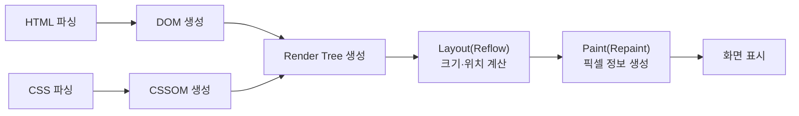

브라우저는 서버로부터 전달받은 HTML·CSS·JavaScript를 해석하여 최종적으로 화면에 픽셀 단위로 표시됨으로써 렌더링된다.  
이 과정은 단순히 “HTML을 읽어 화면을 그린다”로 끝나지 않으며, 문서 구조를 트리로 구성하고 스타일 규칙을 결합한 뒤, 요소의 위치와 크기를 계산하고, 시각적 결과를 칠하고, 마지막으로 레이어를 합성하여 화면에 출력하는 단계로 구성된다.

---
 

## 전체 흐름 요약

---
 

## 1. HTML 파싱과 DOM 생성

브라우저는 HTML 문서를 위에서 아래로 순차적으로 읽으며 파싱(parsing)을 수행하고, 이를 기반으로 **"DOM(Document Object Model)"** 트리를 구성한다.  
DOM은 문서의 구조를 객체 형태로 표현한 것으로, 각 태그는 노드(node)로 변환되어 트리 구조에 포함된다.

이 과정에서 `<script>` 태그를 만나면, 스크립트의 다운로드 및 실행 방식에 따라 HTML 파싱이 일시적으로 중단될 수 있다.  
즉, JavaScript 실행이 DOM 생성 시점에 영향을 미칠 수 있으며, 이는 초기 렌더링 속도와 직결되는 요소가 된다.

---
 

## 2. CSS 파싱과 CSSOM 생성

CSS는 HTML과 별개로 파싱되어 **"CSSOM(CSS Object Model)"** 트리를 형성한다.  
CSSOM은 선택자(selector)와 스타일 규칙(rule)을 구조화한 결과이며, DOM의 각 노드에 어떤 스타일이 적용되어야 하는지를 결정하는 기반이 된다.

특히 CSS는 화면 표시 결과에 즉시 영향을 주기 때문에, 브라우저는 CSSOM이 충분히 준비되지 않은 상태에서 렌더링을 진행하기 어렵다.  
이 특성으로 인해 CSS는 흔히 “렌더링을 지연시킬 수 있는 리소스”로 분류되기도 한다.

---
 

## 3. Render Tree 구성

DOM과 CSSOM이 준비되면 브라우저는 두 정보를 결합하여 **"Render Tree(렌더 트리)"**를 생성한다.  
Render Tree는 “화면에 실제로 그려질 요소”만을 포함하는 트리이다.

예를 들어 display: none이 적용된 요소는 화면에 출력되지 않으므로 Render Tree에서 제외된다.  
반면 visibility: hidden은 공간은 차지하지만 보이지 않기 때문에, Render Tree에는 포함되되 페인팅 단계에서 시각적으로만 제외되는 형태로 처리될 수 있다.

정리하면 DOM은 **구조**, CSSOM은 **규칙**, Render Tree는 **그릴 대상**을 의미한다.

---
 

## 4. Layout(Reflow): 크기와 위치 계산

Render Tree가 구성되면 브라우저는 각 요소의 **크기(width/height)**와 **위치(position)**를 계산한다.  
이 단계를 **Layout** 또는 **Reflow**라고 한다.

레이아웃 계산에는 다음과 같은 요소가 영향을 미친다.

- 박스 모델(margin, border, padding, content)
- 글꼴 크기, 줄바꿈, 텍스트 흐름
- 뷰포트 크기 및 반응형 규칙
- 부모-자식 요소의 배치 관계(플로우, 플렉스, 그리드 등)

Layout 단계가 비용이 큰 이유는, 특정 요소의 크기나 위치가 바뀌면 주변 요소의 배치도 연쇄적으로 영향을 받을 수 있기 때문이다.  
따라서 레이아웃 변경이 잦으면 렌더링 성능이 저하될 가능성이 높다.

---
 

## 5. Paint(Repaint): 픽셀 정보 생성

Layout이 완료되면 브라우저는 요소의 시각적 속성을 실제 픽셀로 **“칠하는”** 단계를 수행한다.  
이를 **Paint** 또는 **Repaint**라고 한다.

Paint 단계에서 처리되는 대표적인 항목은 다음과 같다.

- 색상(color), 배경(background)
- 테두리(border)
- 그림자(box-shadow), 윤곽선(outline)
- 텍스트 렌더링, 이미지 렌더링

이 단계의 결과는 바로 화면에 출력되는 것이 아니라, 보통 “어떤 픽셀을 어떤 순서로 그릴지”에 대한 정보로 정리된다.

---
 

## 마무리

브라우저 렌더링 과정은 다음과 같이 요약할 수 있다.

HTML은 DOM으로, CSS는 CSSOM으로 구성되고,  
DOM과 CSSOM을 결합하여 Render Tree를 만든 뒤,  
Layout으로 배치를 계산하고 Paint로 시각 요소를 칠하며,  
최종 화면을 표시한다.  